<div align="center">

<!-- Animated Header Banner -->


</div>

<div align="left">

```javascript
                                                                                                    
  // The essential Human blueprint                                                                   
  class Human {                                                                                      
    constructor() {                                                                                  
      this.species = "Homo Sapiens";                                                                 
      this.skills = ["breathing", "eating", "sleeping"];      //                    __            _  
    }                                                         //                 | /  \ |      _\(_)/_  @ZeroLinux
  }                                                           //                \_\\  //______/ /(o)\             
                                                              //                 .'/()\'.____/`- /'     \         
  // A Developer is just a Human with extra features          //          Zero    \\`.//\ _ /` \ \\  ,,  /  /    
  class Developer extends Human {                             //       _\(o)/_    /  /`.,' `.,' '-.`\()/`.-'     
    constructor() {                                           //        /(_)\    /__/__/ DevLife--_'(_ )'_--.     
      super();                                                //              .  _.._  \     // /` /`""`\ `\ \    
      this.name = "ZeroLinux";                                //  @ZeroLinux   '    '.'`._,'  |  |  ><  |  |     
      this.mood = "🐧";                                       //              /   __   \/___\,'\ /\      /  /    
      this.os   = "Arch Linux (btw)";                         //           ,  |   ><   |__,__\,-'  '.__.'  linux 
      this.mission = "Building Arch-based ISO from scratch";  //          . \  \      /  / .  \         _\(o)/_  
      this.skills.push("coding", "system design");            //           \_'--`(  )'--'_/       _      /(_)\   
      this.skills.push("linux ricing", "pacman -Syu");        //             .--'/()\'--.      _\( )/_           
    }                                                         //            /  /` d' `\  \      /(O)\            
    greet() {                                                 //          _          @ZeroLinux                  
      return `Hi! I'm ${this.name}...${this.mood}`;           //       _\(_)/_ \      /                          
    }                                                         //        /(O)\                      @ZeroLinux    
  }                                                                                                               
                                                                                                    
  // Say hello!                                                                                      
  console.log(new Developer().greet());                                                              
  // Output: Hi! I'm ZeroLinux...🐧                                                                  
```

</div>

---

### ⌨️ &nbsp; Git Cheatsheet

<div align="center">
  
</div>

---

<div align="center">

## 🐧 About Me

</div>

```bash
$ whoami
zerolinux

$ cat about.txt
╔═══════════════════════════════════════════════════════════════╗
║  🔧 Developer | Tool Builder | Linux Enthusiast               ║
║  🐧 Arch Linux devotee — currently crafting my own ISO        ║
║  🛠️  Passionate about building useful developer tools         ║
║  ⚡ Low-level tinkerer, high-level thinker                    ║
║  🌐 Open source contributor & system architect                ║
╚═══════════════════════════════════════════════════════════════╝

$ uname -a
ZeroLinux 0.1.0-dev Arch-based #1 SMP PREEMPT_DYNAMIC x86_64 GNU/Linux
```

---

<div align="center">

## 🚀 Current Mission

</div>

<div align="center">

```
╔═══════════════════════════════════════════════════════════════════════════════════════════════════╗
║                                                                                                   ║
║  ███████╗███████╗██████╗  ██████╗ ██╗     ██╗███╗   ██╗██╗   ██╗██╗  ██╗                          ║
║  ╚══███╔╝██╔════╝██╔══██╗██╔═══██╗██║     ██║████╗  ██║██║   ██║╚██╗██╔╝                          ║
║    ███╔╝ █████╗  ██████╔╝██║   ██║██║     ██║██╔██╗ ██║██║   ██║ ╚███╔╝                           ║
║   ███╔╝  ██╔══╝  ██╔══██╗██║   ██║██║     ██║██║╚██╗██║██║   ██║ ██╔██╗                           ║
║  ███████╗███████╗██║  ██║╚██████╔╝███████╗██║██║ ╚████║╚██████╔╝██╔╝ ██╗                          ║
║  ╚══════╝╚══════╝╚═╝  ╚═╝ ╚═════╝ ╚══════╝╚═╝╚═╝  ╚═══╝ ╚═════╝ ╚═╝  ╚═╝                          ║
║                                                                                                   ║
║                       🐧  An Arch-based Linux Distribution  🐧                                    ║
║                       Building from zero, one package at a time                                   ║
║                                                                                                   ║
╚═══════════════════════════════════════════════════════════════════════════════════════════════════╝
```

</div>

| Feature | Status |
|--------|--------|
| 🏗️ Base System (Arch) | `🔄 In Progress` |
| 📦 Custom Package Selection | `🔄 In Progress` |
| 🎨 Custom Desktop Environment Config | `📋 Planned` |
| 🛠️ Developer Tools Bundle | `📋 Planned` |
| 📀 ISO Build Script | `📋 Planned` |
| 📚 Documentation | `📋 Planned` |

---

<div align="center">

## 🛠️ Tech Stack & Tools

</div>

<div align="center">

<!-- Languages -->


<!-- Linux & Tools -->


</div>

---
<div align="center">
  

<div align="center">

## 📊 GitHub Stats

</div>

<div align="center">
  
</div>

<div align="center">
  <table border="0" cellspacing="0" cellpadding="0">
    <tr>
      <td align="center">
        
      </td>
      <td align="center">
        
      </td>
    </tr>
  </table>
</div>

<div align="center">
  
</div>

<div align="center">
  
</div>

---

<div align="center">

## 💡 Dev Philosophy

```
"Zero bloat. Zero compromise. Built from scratch."
```

> I believe in understanding every layer of the stack —  
> from the kernel up. If I can't build it, I don't deserve to use it.

</div>

---

<div align="center">

## 🌐 Connect

[](https://github.com/zerolinux-os)

</div>

<!-- Footer -->

